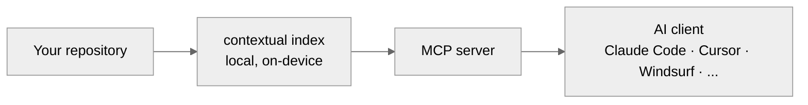

<picture>
  <source media="(prefers-color-scheme: dark)" srcset=".github/assets/logo-wordmark-dark.png">
  
</picture>

<p align="center"><em>Your AI's memory.</em></p>

<p align="center">
  Temporal semantic search that remembers everything your AI forgets — a
  context engine that runs entirely on your machine, indexed, queryable, and
  aware of how your repository changed over time.
</p>

<p align="center">
  
  <a href="https://contextuallabs.dev"></a>
  <a href="https://contextuallabs.dev/docs"></a>
  <a href="https://github.com/Contextual-Laboratories/Contextual-Labs/releases"></a>
  <a href="LICENSE"></a>
</p>

<p align="center">
  <a href="#install"><b>Install</b></a> ·
  <a href="#what-is-contextual">What is Contextual?</a> ·
  <a href="#documentation">Docs</a> ·
  <a href="#report-a-bug-or-request-a-feature">Support</a>
</p>

<p align="center"><code>LOCAL</code> · <code>SECURE</code> · <code>UNIVERSAL</code></p>

<br>

Contextual indexes a codebase locally and exposes it through an MCP server
and CLI — giving AI coding agents structural call resolution, class-hierarchy
awareness, and temporal, git-history-aware retrieval. Grounded answers about
what a codebase actually does, not what a model assumes it does.

This repository is the **public home of Contextual**: documentation, and the
place to report bugs or request features. It is proprietary, closed-source
software — this repository does not contain, and will never contain, the
engine's source code.

<table>
<tr>
<td align="center" width="25%"><b>~5 min</b><br><sub>to index 50k LOC</sub></td>
<td align="center" width="25%"><b>~0.8 GB</b><br><sub>single static install</sub></td>
<td align="center" width="25%"><b>0 bytes</b><br><sub>of code sent to a server</sub></td>
<td align="center" width="25%"><b>~94 ms</b><br><sub>median recall latency</sub></td>
</tr>
</table>

## Install

```bash
uv tool install contextual-engine
```

`pipx` works the same way if you don't use `uv`:

```bash
pipx install contextual-engine
```

Then, from the root of the repository you want Contextual to understand:

```bash
contextual init
contextual index
```

Connect an AI client (Claude Code, Claude Desktop, Cursor, Windsurf, and
others), and it can now ground its answers in your actual codebase — not a
guess. Full walkthrough: [Getting Started](docs/cli/tutorials/getting-started.md).

## What is Contextual?

Contextual is a local-first context engine for AI coding agents: a CLI and
MCP server that build a structural + semantic + temporal understanding of a
codebase on-device, then serve it to whatever agent is asking. No code ever
leaves the machine.

<table>
<tr>
<td width="33%" valign="top">
<b>Structural</b>
<br><br>
Call graphs, class hierarchies, and dependency edges — not just text matches.
</td>
<td width="33%" valign="top">
<b>Semantic</b>
<br><br>
Code-specialized embeddings for meaning-aware search — not keyword grep.
</td>
<td width="33%" valign="top">
<b>Temporal</b>
<br><br>
Git-history-aware, so "what did this used to do" is answerable — not just "what does it do now."
</td>
</tr>
</table>

Use it for onboarding onto an unfamiliar codebase, keeping an AI agent
grounded in a large monorepo, code review context, or any workflow where
"the model guessed" isn't good enough.



## Documentation

Full docs: [contextuallabs.dev/docs](https://contextuallabs.dev/docs) — or
browse them directly in this repo:

- [`docs/cli/`](docs/cli/) — the Python CLI
- [`docs/mcp-server/`](docs/mcp-server/) — the MCP server and its tools
- [`docs/web-dashboard/`](docs/web-dashboard/) — the web dashboard
- [`docs/concepts/`](docs/concepts/) — architecture and cross-cutting concepts
- [`docs/account/`](docs/account/) — licensing, trial, device management
- [`docs/changelog/`](docs/changelog/) — release notes

## Report a bug or request a feature

GitHub Issues is the official channel for bug reports, docs feedback, and
feature requests. Contextual is closed-source, proprietary software, so this
isn't a place for code contributions — it's where the community side of this
project actually lives: tell us what's broken, what's missing, or what you'd
like to see.

[**Open an issue**](../../issues/new/choose) and pick the template that
matches. Typical first response is 1–3 business days — see
[`SUPPORT.md`](SUPPORT.md) for the full detail, and
[`SECURITY.md`](SECURITY.md) to report a vulnerability privately instead.

For anything else: [team@contextuallabs.dev](mailto:team@contextuallabs.dev)

## License

All rights reserved — this repository's content is publicly viewable, not
publicly licensed. No commercial use, copying, or redistribution is
permitted. See [`LICENSE`](LICENSE). Contextual (the CLI/MCP server) is
closed-source, licensed software — see [contextuallabs.dev](https://contextuallabs.dev)
for terms.
