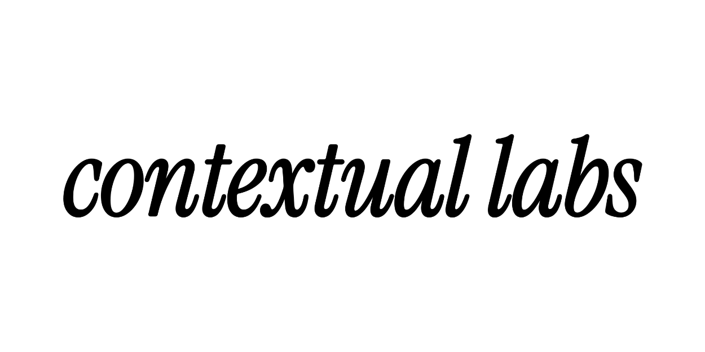

<div align="center">
  
</div>

<p align="center"><em>Your AI's memory.</em></p>

<p align="center">
  Temporal semantic search that remembers everything your AI forgets — a
  context engine that runs entirely on your machine, indexed, queryable, and
  aware of how your repository changed over time.
</p>

<p align="center">
  <a href="https://contextuallabs.dev"></a>
  <a href="https://contextuallabs.dev/docs"></a>
  <a href="https://github.com/Contextual-Laboratories/Contextual-Labs/releases"></a>
  <a href="LICENSE"></a>
</p>

<p align="center">
  <a href="#install"><b>Install</b></a> ·
  <a href="#what-is-contextual">What is Contextual?</a> ·
  <a href="#documentation">Docs</a> ·
  <a href="#support">Support</a>
</p>

<br>

Contextual indexes a codebase locally and exposes it through an MCP server
and CLI — giving AI coding agents structural call resolution, class-hierarchy
awareness, and temporal, git-history-aware retrieval. Grounded answers about
what a codebase actually does, not what a model assumes it does.

This repository is the **public home of Contextual**: documentation, and the
place to report bugs or request features. It is proprietary, closed-source
software — this repository does not contain, and will never contain, the
engine's source code.

- **Time to first index** — ~5 min for 50k LOC
- **Package size** — ~0.8 GB, single static install
- **Code sent to a server** — 0 bytes, 100% local inference
- **Median recall latency** — ~94 ms

## Install

```bash
uv tool install contextual-engine
```

`pipx` works the same way if you don't use `uv`:

```bash
pipx install contextual-engine
```

Then, from the root of the repository you want Contextual to understand:

```bash
contextual init
contextual index
```

Connect an AI client (Claude Code, Claude Desktop, Cursor, Windsurf, and
others), and it can now ground its answers in your actual codebase — not a
guess. Full walkthrough: [Getting Started](docs/cli/tutorials/getting-started.md).

## What is Contextual?

Contextual is a local-first context engine for AI coding agents: a CLI and
MCP server that build a structural + semantic + temporal understanding of a
codebase on-device, then serve it to whatever agent is asking. No code ever
leaves the machine.

- **Structural** — call graphs, class hierarchies, and dependency edges, not just text matches
- **Semantic** — code-specialized embeddings for meaning-aware search, not keyword grep
- **Temporal** — git-history-aware, so "what did this used to do" is answerable, not just "what does it do now"

## Documentation

Docs are organized by product surface, each following the
[Diátaxis](https://diataxis.fr/) framework (tutorials, how-to guides,
reference, explanation):

- [`docs/cli/`](docs/cli/) — the Python CLI
- [`docs/mcp-server/`](docs/mcp-server/) — the MCP server and its tools
- [`docs/web-dashboard/`](docs/web-dashboard/) — the web dashboard
- [`docs/concepts/`](docs/concepts/) — cross-cutting architecture/concepts
- [`docs/account/`](docs/account/) — licensing, trial, device management
- [`docs/changelog/`](docs/changelog/) — release notes

This repository is a published mirror, not the authoring source — docs are
written once upstream and synced here automatically. See each folder's
`README.md` for what belongs where.

## Support

- **Docs feedback, product bugs, feature requests:** [GitHub Issues](../../issues) — pick the template that matches.
- **Everything else:** [team@contextuallabs.dev](mailto:team@contextuallabs.dev)

## License

All rights reserved — this repository's content is publicly viewable, not
publicly licensed. No commercial use, copying, or redistribution is
permitted. See [`LICENSE`](LICENSE). Contextual (the CLI/MCP server) is
closed-source, licensed software — see [contextuallabs.dev](https://contextuallabs.dev)
for terms.
