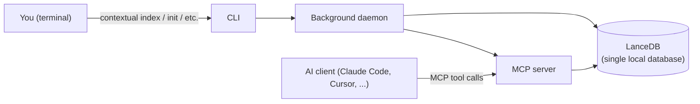

<Callout variant="tldr">
Four pieces, all local: the `contextual` CLI you run by hand, a
background daemon that keeps a workspace warm, an MCP server the daemon
exposes for your AI client to call, and a single LanceDB database on disk
that everything reads from and writes to. No part of this talks to a
remote server to do its job.
</Callout>

## The four pieces

**The CLI** (`contextual`) is what you type. Commands like `init`,
`index`, `client`, and `workspace` either do one-shot work directly (like
writing a config file) or talk to the daemon for anything that needs a
long-lived process.

**The daemon** is a background process, one per machine, that owns your
workspace registry and keeps the MCP server warm so your AI client
doesn't pay a cold-start cost on every question. `contextual mcp status`
tells you whether it's running; `contextual mcp start`/`stop`/`restart`
control it directly. See `engine/observability/` for what a healthy vs.
unhealthy daemon actually looks like.

**The MCP server** is what your AI client actually talks to. It's the
same daemon process, speaking the Model Context Protocol — a
standardized way for an AI client to discover and call tools. This is
where all 22 of Contextual's tools live (search, graph, temporal,
system, co-change — see `mcp-server/reference/` for the full list).

**The storage layer** is a single LanceDB database, on disk, per
workspace, inside that workspace's `.contextual/` directory. Every kind
of data Contextual keeps about your repository — semantic embeddings,
the dependency graph, temporal/blame history, decisions — lives in this
one store, not several different databases stitched together. See
`engine/reference/storage-schema-reference` for the table-level detail.

## What actually happens when you run `contextual index`

At a conceptual level, not the exact tuned parameters: your files are
split into chunks, each chunk gets a local embedding (no network call),
your code's structural relationships (calls, imports, inheritance) get
extracted into a dependency graph, and your git history gets walked to
attach blame and temporal metadata to what was extracted. All four
outputs land in the same LanceDB store. `engine/explanation/how-indexing-
works` covers this pipeline stage by stage.

## What stays on your machine

No step above makes a network call to index or query your code. The
embedding model runs locally and is CPU-only. The only outbound network
traffic Contextual makes on its own is license validation and update
checks — never your source code, queries, or any derived data. See
`engine/reference/data-privacy` for the specific, complete list of what
does and doesn't leave your machine.
