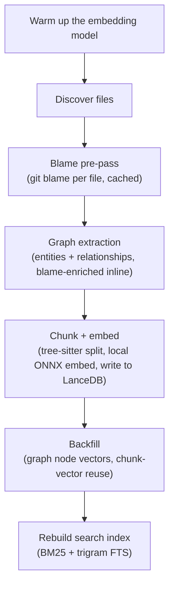

<Callout variant="tldr">
`contextual index` runs six stages in a fixed order: model warmup, file
discovery, blame history extraction, dependency-graph extraction, chunking
+ embedding, then a backfill + search-index rebuild. Graph extraction runs
*before* embedding, not after — a deliberate reorder, not an accident.
</Callout>

## The six stages, in the order they actually run

**1. Model warmup.** The local embedding model loads once, up front, so its
5-10s cold-start cost is paid before any per-file timing starts — not
buried inside the first embed call where it would skew per-batch metrics.

**2. File discovery.** A recursive walk of your repository, filtered by
`.contextualignore` and `.gitignore` (see
`indexing/reference/contextualignore-reference`). Runs in a thread pool so it
doesn't block anything else.

**3. Blame pre-pass.** For every file about to be indexed, Contextual runs
`git blame` as a native subprocess (first-parent, with an enforced timeout)
and caches the result. This has no dependency on graph or embedding
output — it only needs the file paths and git history.

**4. Graph extraction.** Tree-sitter parses each file's AST and extracts
entities (functions, classes, imports, ...) and structural relationships
(calls, inherits, imports, ...) into the dependency graph. Each entity is
enriched with `authored_by`/commit attribution inline, using the blame data
from stage 3 — there's no separate attribution pass afterward. See
`graph/explanation/the-knowledge-graph` for what actually gets extracted.

**5. Chunk + embed.** Each file is split into chunks by a tree-sitter-aware
split-merge algorithm — target 1,500 bytes, max 2,000, min 50, and it never
splits mid-function. Chunks are content-hashed (BLAKE3) so an unchanged
chunk is never re-embedded. Each chunk gets a local embedding (no network
call) and is written to LanceDB.

**6. Backfill + search rebuild.** Graph nodes that need a vector
representation (for `nexus_search`'s semantic seed lookup) get one here,
reusing chunk vectors from stage 5 where possible instead of re-embedding.
Finally, the BM25 and trigram full-text search indexes are rebuilt so
`search` returns fresh results without a daemon restart.

<Callout variant="note">
Graph extraction (stage 4) runs *before* chunking and embedding (stage 5),
not after. This was a deliberate July 2026 reorder: graph extraction was
measured taking ~76 minutes inside the full pipeline despite being
provably ~20-30 seconds in isolation, with no data-size scaling issue —
the leading theory was resource contention with the embedding model's ONNX
session (which claims every CPU core) when the two stages ran back to
back. Nothing in graph extraction actually depends on chunks or
embeddings, so moving it earlier sidestepped the contention question
instead of fully diagnosing it. Only the backfill step (stage 6) needs
embeddings, so it correctly stays last.
</Callout>

## What each stage does *not* do

Graph extraction and blame extraction are both non-fatal: a failure in
either is logged and swallowed rather than aborting the whole index run —
a syntax-broken file or an ungraphable language shouldn't stop the rest of
your repository from getting indexed and searchable.

Nothing in any of these six stages makes a network call. The embedding
model runs locally, CPU-only. See `trust-and-privacy/reference/data-privacy` for the
complete list of what does and doesn't leave your machine.

## Force vs. incremental

Everything above describes a full index (`contextual index --force`, or
the first `contextual index` in a workspace). `contextual index
--incremental` and the file-watcher-driven path skip straight to
processing only the changed files, and run graph extraction per-file
rather than as a batch pass — see
`indexing/explanation/incremental-vs-scheduled-indexing` for how that path
differs.
