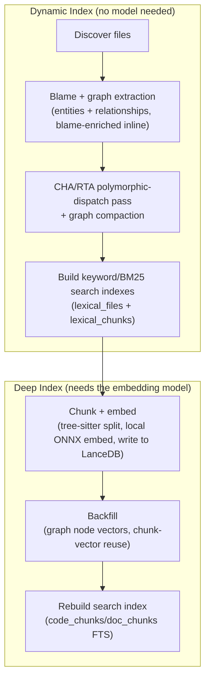

<Callout variant="tldr">
`contextual index` runs as a detached background job with two tiers.
**Dynamic Index** — file discovery, blame, dependency-graph extraction,
and keyword/BM25 search — commits first and needs no embedding model.
**Deep Index** — chunking and embedding — runs after it, in the
background, and is the only tier that needs the model. Graph, blame, and
keyword search are usable the moment Dynamic Index finishes; semantic
search fills in once Deep Index completes.
</Callout>

## The two tiers, in the order they actually run

```mermaid
flowchart TD
    subgraph dyn["Dynamic Index (no model needed)"]
        A[Discover files] --> B["Blame + graph extraction\n(entities + relationships, blame-enriched inline)"]
        B --> C["CHA/RTA polymorphic-dispatch pass\n+ graph compaction"]
        C --> D["Build keyword/BM25 search indexes\n(lexical_files + lexical_chunks)"]
    end
    D --> E
    subgraph deep["Deep Index (needs the embedding model)"]
        E["Chunk + embed\n(tree-sitter split, local ONNX embed, write to LanceDB)"] --> F["Backfill\n(graph node vectors, chunk-vector reuse)"]
        F --> G["Rebuild search index\n(code_chunks/doc_chunks FTS)"]
    end
```

### Dynamic Index — commits first, no model required

**1. File discovery.** A recursive walk of your repository, filtered by
`.contextualignore` and `.gitignore` (see
`indexing/reference/contextualignore-reference`). Runs in a thread pool so it
doesn't block anything else.

**2. Blame + graph extraction.** For every discovered file, Contextual
runs `git blame` as a native subprocess (first-parent, cached, enforced
timeout), then tree-sitter parses the file's AST and extracts entities
(functions, classes, imports, ...) and structural relationships (calls,
inherits, imports, ...) into the dependency graph, enriched with
`authored_by`/commit attribution inline from the blame pass. See
`graph/explanation/the-knowledge-graph` for what actually gets extracted.

**3. CHA/RTA pass + graph compaction.** A polymorphic-dispatch analysis
pass resolves interface/abstract-method calls to their concrete
implementations, followed by graph compaction — both moved here because
neither one actually needs the embedding model.

**4. Keyword/BM25 search indexes.** File content is written to a dedicated
`lexical_files` table at whole-file granularity. The same tree-sitter
chunker Deep Index uses also runs here and writes function- and
class-sized chunks to a separate `lexical_chunks` table, with no
embedding involved. Neither table depends on the embedding model, so
keyword search works the moment this stage commits, independent of how
long Deep Index takes, and chunk-level matches can point at the right
function instead of just the right file. Both tables are removed
automatically a couple of hours after Deep Index completes for a
workspace, since the full chunk indexes replace them.

Once Dynamic Index finishes, `search`/`nexus_search`, graph traversal,
blame-enriched tools, and `co_change_analysis` are all fully queryable —
`search`/`nexus_search` transparently fall back to the keyword layer
(`lexical_chunks` and `lexical_files`) if Deep Index hasn't caught up yet for this workspace (see
`retrieval/how-to/understand-stale-or-missing-results`). `contextual
index`'s watch loop (and a `--status` call attaching after the fact)
prints a persisted "dynamic index ready" milestone the moment this tier
commits — see `cli/reference/general/index`.

### Deep Index — runs after, in the background

**5. Chunk + embed.** Each file is split into chunks by a tree-sitter-aware
split-merge algorithm — target 1,500 bytes, max 2,000, min 50, and it never
splits mid-function. Chunks are content-hashed (BLAKE3) so an unchanged
chunk is never re-embedded. Each chunk gets a local embedding (no network
call) and is written to LanceDB.

**6. Backfill + search rebuild.** Graph nodes that need a vector
representation (for `nexus_search`'s semantic seed lookup) get one here,
reusing chunk vectors from stage 5 where possible instead of re-embedding.
Finally, the `code_chunks`/`doc_chunks` full-text indexes are rebuilt so
`search` returns fresh results without a daemon restart.

<Callout variant="note">
When the MCP daemon is running, the indexing job sends its embedding
requests to the daemon's already-loaded model instead of loading a
second copy in its own process. While it does, it holds a short-lived,
machine-wide lease (renewed every 20 seconds, abandoned after 90 seconds
of silence, so a crashed job can't block anything) and the daemon's
incremental file watchers hold their own embedding work until the lease
is released. Deferred changes are picked up by a reconcile pass
afterward, so nothing is lost. The earlier behavior, two model copies
competing for the same CPU cores and a lot of memory, caused erratic
per-batch latency. With no daemon running, the job loads its own model
for the whole phase as before. If the daemon becomes unreachable partway
through a run, the job fails loudly instead of silently loading a second
copy.
</Callout>

<Callout variant="note">
Within Dynamic Index, graph/blame extraction runs *before* Deep Index's
chunking and embedding — a deliberate July 2026 reorder that predates the
tiered split: graph extraction was measured taking ~76 minutes inside the
full pipeline despite being provably ~20-30 seconds in isolation, the
leading theory being resource contention with the embedding model's ONNX
session (which, at the time, claimed every CPU core) when the two ran back
to back.
Nothing in graph extraction depends on chunks or embeddings, so it
correctly belongs in the tier that doesn't wait on the model at all.
</Callout>

## What each stage does *not* do

Graph extraction and blame extraction are both non-fatal: a failure in
either is logged and swallowed rather than aborting the whole index run —
a syntax-broken file or an ungraphable language shouldn't stop the rest of
your repository from getting indexed and searchable.

Nothing in either tier makes a network call. The embedding model runs
locally, CPU-only. See `trust-and-privacy/reference/data-privacy` for the
complete list of what does and doesn't leave your machine.

## Crash recovery, cancellation, and background operation

The whole job — both tiers — runs in a detached process, not in your
terminal's own process. `contextual index` attaches to it and shows live
progress, but closing that terminal or pressing Ctrl+C only stops
*watching* — the job keeps running. Reattach any time with `contextual
index` (it detects the job already running for this workspace) or
`contextual index --status`. Stop it for real with `contextual index
--cancel`. If the job process itself dies (crash, `kill -9`, power loss),
the next `contextual index` or a `contextual doctor` run detects it and
either resumes or reports it, rather than silently reading as healthy —
see `cli/reference/general/index` and
`observability/how-to/interpreting-doctor-report`.

## Force vs. incremental

Everything above describes a full index (`contextual index --force`, or
the first `contextual index` in a workspace) — this is what runs the
Dynamic/Deep Index split. `contextual index --incremental` and the
file-watcher-driven path skip straight to processing only the changed
files, running graph extraction and embedding per-file rather than as a
batch pass, and typically finish in seconds rather than needing the
tiered split at all — see
`indexing/explanation/incremental-vs-scheduled-indexing` for how that path
differs.
