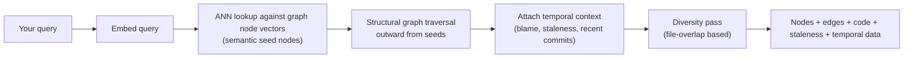

<Callout variant="tldr">
`nexus_search` is a separate code path from `search`, not a wrapper
around it: it embeds your query, finds semantic seed nodes directly in
the graph, walks outward from them structurally, and attaches staleness
and temporal data to every node it returns — combining semantic,
structural, and temporal signals into one response.
</Callout>

## What it actually does, in order

1. Your query is embedded with the same local model used everywhere else
   in Contextual.
2. That embedding is matched directly against graph node vectors (an
   approximate-nearest-neighbor lookup) to find semantic seed nodes — the
   graph entities most conceptually related to your query, not just
   textually similar chunks.
3. From those seeds, a structural breadth-first traversal walks outward
   through the graph's real relationships (calls, imports, inherits, and
   the rest of the taxonomy in `graph/explanation/the-knowledge-graph`).
4. Every node picked up along the way gets its temporal context attached
   — recent commits, blame attribution, and a current staleness score
   (see `temporal/explanation/temporal-intelligence`).
5. A diversity pass (using file-path overlap as its similarity signal,
   distinct from `search`'s MMR) thins the result so you don't get ten
   nodes from the same file crowding out everything else.

The result is nodes with their code, the edges connecting them, staleness
scores, and temporal data — all in one call, instead of one `search` call
plus a follow-up `graph_traverse` plus a follow-up `get_temporal_context`.

## This is a genuinely separate path from `search`

`nexus_search` doesn't call into `search`'s BM25+dense+trigram RRF fusion
pipeline at all — it has its own semantic seed lookup straight against
graph vectors, its own traversal logic, and its own diversity pass. This
matters for one specific reason: a ranking refinement added to `search`
(like its structural symbol-name boost) does not automatically apply to
`nexus_search`, and vice versa — the two tools are tuned and improved
independently, not two views onto one shared ranking stage.

If graph node vectors haven't been populated yet (early in a fresh
index, before the backfill stage described in
`indexing/explanation/how-indexing-works` has run), `nexus_search` falls
back to a keyword-based seed lookup rather than returning nothing.

## When to reach for this instead of `search`

`search` answers "find code related to this" as text. `nexus_search`
answers the same question but keeps going outward through real
structural relationships and tells you how fresh what it found actually
is — reach for it when the *connections* between results matter as much
as the results themselves (understanding a subsystem, not just finding
one function). See `mcp/tools/how-to/choose-between-search-and-nexus-search`
for the more tactical version of this call.

## Related, but distinct: `co_change_analysis`

A different kind of temporal-graph signal lives in `co_change_analysis`
— it measures how often two files change together in the same commits
(a Jaccard-style coupling score, not a structural graph edge) and flags
when two files are strongly coupled in git history despite having *no*
structural relationship between them (`is_undeclared_coupling`) — a
concrete way to surface hidden, undocumented coupling that a pure
dependency-graph view would never catch, because it isn't a `calls` or
`imports` edge at all, just a repeating pattern in commit history.
