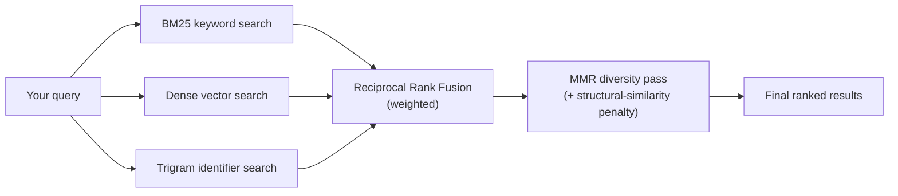

<Callout variant="tldr">
A `search` call runs three retrieval methods in parallel — BM25 keyword
search, dense vector search, and a trigram identifier index — fuses their
ranked lists with Reciprocal Rank Fusion, then re-orders the fused result
for diversity with Maximal Marginal Relevance. There is no cross-encoder
reranking stage: it was evaluated and removed.
</Callout>

## Three retrieval methods, run together

**BM25** is classic keyword/full-text search — good at exact identifier
and literal-string matches. **Dense** search embeds your query with the
same local model used at index time and finds semantically similar
chunks — good at conceptual queries that don't share exact wording with
the code. **Trigram** search matches over a 3-gram index of identifiers
specifically, which catches partial or fuzzy identifier matches that
BM25's whole-token matching misses.

Each method returns its own ranked candidate list; the three lists are
combined with weighted **Reciprocal Rank Fusion** — a rank-based fusion
method, not a raw-score blend, so the three signals (which have
incomparable native score scales) combine fairly. Dense search carries
the most weight in the fusion, BM25 next, trigram least — reflecting that
semantic similarity is usually the strongest single signal for a natural-
language query, with the other two catching what it misses.

## No reranking stage

Ranking stops at RRF fusion plus the diversity pass below — there is no
cross-encoder reranking stage. If you've used a retrieval system
elsewhere that reranks, don't assume Contextual has an equivalent stage:
fusion plus MMR diversity selection is the complete ranking pipeline.

## Diversity, not just relevance

Fusion alone tends to return several near-duplicate chunks from the same
file or symbol if they're all individually relevant. A **Maximal Marginal
Relevance** pass re-orders the fused candidates to balance relevance
against diversity, plus a structural-similarity penalty (using a
MinHash-based near-duplicate check) that specifically discourages
returning several chunks that are structurally very similar to each
other, on top of the plain file/symbol-level diversity MMR already
provides.

## Query-shaping details worth knowing

**Temporal-phrase stripping.** A query like "who last modified the auth
module" gets its temporal framing ("who last modified") stripped out
before it's sent to the dense embedder specifically — the embedding model
does better matching the underlying subject than the whole phrase intact.
BM25 and trigram search still see your query as written.

**Exact-match override.** If your query is a single bare identifier (no
whitespace), an exact `symbol_name` match is spliced in at the very top
of the results before the diversity pass runs — so searching for a known
function name reliably surfaces that function even if fusion alone
wouldn't have ranked it first.

**Config-file exclusion.** In code-search mode, JSON/YAML/TOML/HTML/CSS/
Markdown/Dockerfile chunks are excluded from candidate generation
entirely, not just down-ranked — so a code query isn't competing against
your `package.json` for a results slot.

<Callout variant="note">
`search`'s structural boost (a ranking bump when a query token exactly
matches a chunk's symbol name) is specific to `search` itself — it is not
part of `nexus_search`'s separate ranking path. See
`nexus/explanation/nexus-enrichment` for how that tool's semantic-seed +
graph-traversal approach differs.
</Callout>

## What determines "hybrid" vs. "BM25-only"

Dense and trigram search both depend on a populated vector/ngram index.
If hybrid search is unavailable or disabled, Contextual falls back to
BM25-only rather than failing the query outright — a degraded result is
preferred over no result.
